# Raster Image Manipulation

In these exercises you will apply your knowledge of functional programming
to the task of *image processing*.

The exercises will help you practice the following skills:

- Exploring and using a new API.
- Applying algorithms to multi-dimensional data.
- Handling boundary conditions.
- Using `map` and `mapi` functions.

## Background

You can think of a digital image as a large two-dimensional array of pixels,
each of which has a red (R) value, a green (G) value, and a blue (B) value.
An R, G, or B value is just an integer between 0 and a maximum value defined by the image
(usually 255 or 65535). To transform an image, you can *map over* all of these pixels,
one at a time, and do something to some or all of the pixels. For example, to generate
a new image with all of the green color removed from each pixel:

```
let no_green img = Image.map img ~f:(fun (r, g, b) -> (r, 0, b))
```

## Prep Work

First fork this repository by visiting
[this page](https://github.com/jane-street-immersion-program/raster/fork) and
clicking on the green "Create fork" button at the bottom.

Then clone the fork locally (on your AWS machine) to get started.
You can clone a repo on the command line like this
(where $USER is your GitHub username):

```console
$ git clone git@github.com:$USER/raster.git
Cloning into 'raster'...
remote: Enumerating objects: 64, done.
remote: Counting objects: 100% (64/64), done.
remote: Compressing objects: 100% (48/48), done.
remote: Total 64 (delta 10), reused 59 (delta 9), pack-reused 0
Receiving objects: 100% (64/64), done.
Resolving deltas: 100% (64/64), done.
```

Now you should be able to enter the project directory, build the starter code, and
run the executable binary like this:

```console
$ cd raster/
$ dune build
$ dune runtest
$ ./_build/default/bin/image_exercise.exe help
A tool to perform various image manipulations

  image_exercise.exe SUBCOMMAND

=== subcommands ===

  bluescreen                 . Replace the 'blue' pixels of an image with those
                               from another image
  blur                       . Blur an image
  dither                     . Dither an image
  grayscale                  . Convert an image to grayscale
  version                    . print version information
  help                       . explain a given subcommand (perhaps recursively)
```

## Directory Layout

The files for this exercise are contained in this repository. These files are:

- `src` directory
    - `pixel.ml` and `pixel.mli`: an OCaml library representing an RGB image pixel
    - `image.ml` and `image.mli`: an OCaml library you will use to interact with PPM files
    - `grayscale.ml`: you will modify this file to implement your solution to problem 1
      (Grayscale)
    - `blue_screen.ml`: you will modify this file to implement your solution to problem 2
      (Blue Screening)
    - `blur.ml`: you will modify this file to implement your solution to problem 3 (Blur)
    - `dither.ml`: you will modify this file to implement your solution to problem 4
      (Dithering)
    - `image_exercise_lib.ml` and `image_exercise_lib.mli`: a module to set up the
      terminal commands for each problem.
- `bin` directory
    - `image_exercise.ml` and `image_exercise.mli`: a module that wraps around the
      Image_exercise_lib module in the `src` dir.
- `images` directory
    - `beach_portrait.ppm`: a picture of some backpacking goofball, used as the input
      image for `grayscale.ml`
    - `oz_bluescreen.ppm`: a still photo from the set of the 2013 film *Oz the Great
      and Powerful*, used as one of the input images for `blue_screen.ml`
    - `meadow.ppm`: a peaceful meadow scene, used as one of the input images for
      `blue_screen.ml`
    - `reference-beach_portrait_gray.ppm`: the expected output image for `grayscale.ml`,
      provided for your reference
    - `reference-oz_bluescreen_vfx.ppm`: the expected output image for `blue_screen.ml`,
      provided for your reference
    - `reference-beach_portrait_blur.ppm`: the expected output image for `blur.ml`,
      provided for your reference
    - `reference-beach_portrait_dither.ppm`: the expected output image for `dither.ml`,
      provided for your reference
    - `reference-oz_bluescreen_vfx_improved.ppm`: an example output image for the
      [improved blue screening](#improved-blue-screening) extension, provided for your
      reference
    - `reference-meadow-solarize.ppm`: the expected output image for the
      [solarize](#solarize) extension, provided for your reference
    - `reference-beach_portrait_dither_color.ppm`: the expected output image for the
      [color dithering](#color-dithering) extension, provided for your reference
    - `reference-beach_portrait_edge.ppm`: the expected output image for the [edge
      detection](#edge-detection) extension, provided for your reference
    - `reference-beach_portrait_mosaic.ppm`: an example output image for the
      [mosaic](#mosaic) extension, provided for your reference
- `test` directory
    - Starter code for unit tests you may wish to write.

## PPM Images

For this exercise, we'll use the PPM (Portable Pixel Map) image format. While it's not the
most efficient format, is very simple and human-readable thanks to being a plain ASCII
text file. The specifics of the format are not particularly important, though if you're
curious you can read more [here](https://netpbm.sourceforge.net/doc/ppm.html).

To make it easy to view these images, you'll want to install the [PBM/PPM/PGM Viewer for
Visual Studio
Code](https://marketplace.visualstudio.com/items?itemName=ngtystr.ppm-pgm-viewer-for-vscode)
extension. To do so:

1. Go to the extensions tab (*View* &rarr; *Extensions*).
1. Search for "ppm", and install the extension (should be the first result by *ngtystr*).
1. With this extension installed, clicking on any `.ppm` file will display the image.

If you want to see the ASCII text, right-click on the file, select *Open With...*,
and select *Text Editor* from the drop-down menu.

## 1 Grayscale
Modify `grayscale.ml` to implement the `transform` function to return a black-and-white or
*grayscale* version of the input image. In the RGB color model, gray tones are produced
when the values of red, green, and blue are all equal. A simple way to do this conversion
is to set the red, green, and blue values for each pixel to the average of those values in
the original image. That is $R_{gray} = G_{gray} = B_{gray} = \frac{R + G + B}{3}$. When
you have implemented a correct solution, running

```sh
dune exec bin/image_exercise.exe -- grayscale -filename images/beach_portrait.ppm
```

from the project directory should produce a file called `beach_portrait_gray.ppm`
that is the same image as `reference-beach_portrait_gray.ppm`:

<center>
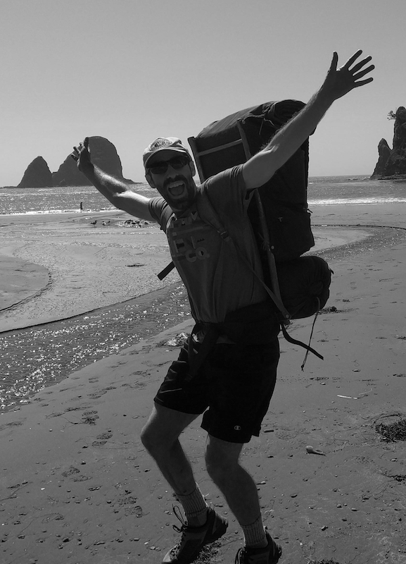
</center>

### Write an expect test
For this and the following exercises, you'll write an expect test to verify that your solution is correct.
Since you're working with images, a manually testing by looking at the output image is always a good first step.
But automated expect tests have some key advantages:

1. They run every time the code is compiled, so they automatically catch situations where a future change introduces a bug with older code.
2. They can be more precise than visual inspection, and catch bugs that aren't visually obvious (such as a bug where pixels at the edge of the image are not being correctly transformed).

The easiest way to write such a test is to make use of the reference image we provide (`images/reference-beach_portrait_gray.ppm`).
If the image your code produces is the same as the reference image, then your code is correct.

It's worth thinking carefully about what your test should print in the case where the images are different.
The simplest thing is to display a message like `"Output doesn't match reference"`, but this isn't the most useful for debugging.
Printing out the difference between the expected output and the actual output is generally a good testing strategy.
For images, this can work if the difference is small enough, but you'll probably find it more useful to print summary information (e.g., the number of pixels that differ) or a subset of the results (e.g., the location and values of the first pixel that differs).

## 2 Blue Screening
Movies&mdash;particularly (non-animated) action movies that use a lot of special
effects&mdash;often use a technique called *blue screening* to generate some scenes. The
actors in a scene are filmed as they perform in front of a blue screen and, later, the
special-effects crew removes the blue from the scene and replaces it with another
background (an ocean, a skyline, the Jane Street office). The same technique is used for
television weather reports&mdash;the meteorologist is not really gesturing at cold fronts
and snow storms, just at a blank screen. [Sometimes *green screening* is used instead;
the choice depends on things like the skin tone of the star.] This problem asks you to do
something similar.

We can *combine* an image of, say, James Franco on the set of *Oz the Great and Powerful*
(`oz_bluescreen.ppm`) with an image of scenery (`meadow.ppm`) by replacing the bluish
pixels in the first picture with pixels from a background picture. To do this, we have to
figure out which pixels are bluish (and can be changed) and which ones correspond to the
actor and props (and should be left alone). Identifying which pixels are sufficiently blue
is tricky. Here's an approach that works reasonably well here: count any pixel that
satisfies the following formula as "blue" for the purposes of blue screening: $B > R + G$.

Modify the `transform` function in `blue_screen.ml` to use this formula to return a new
image with the appropriate pixels in `image` replaced with pixels from `background`. When
you have implemented a correct solution, running

```sh
dune exec bin/image_exercise.exe -- bluescreen -foreground images/oz_bluescreen.ppm \
  -background images/meadow.ppm
```

from the project directory should produce a file called `oz_bluescreen_vfx.ppm` that is
the same image as `reference-oz_bluescreen_vfx.png`.

<div style="font-size: xx-large; text-align: center">
 +
     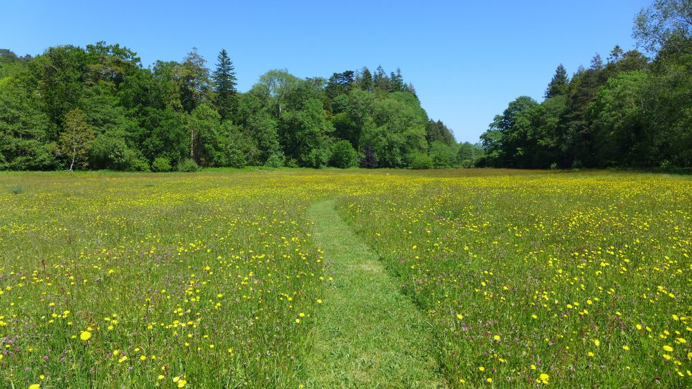 =
</div>
<center>

</center>

### Write an expect test
Write an expect test that uses the provided reference image (`images/reference-oz_bluescreen_vfx.png`)
to verify that your solution is correct.

## 3 Blur
Modify `blur.ml` to implement the `transform` function. `transform` should create and
return a blurry version of the image (`image`). For each pixel, average all of the pixels
within a square `radius` of that pixel. Here's an example what that means:

<center>
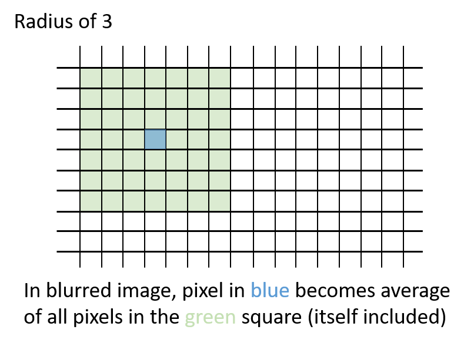
</center>

Each pixel will become the average of the square of pixels around it. Pixels at the edges
of the image will use whatever part of the square actually exists. Here's an animation of
how the square radius moves with each pixel:

<center>
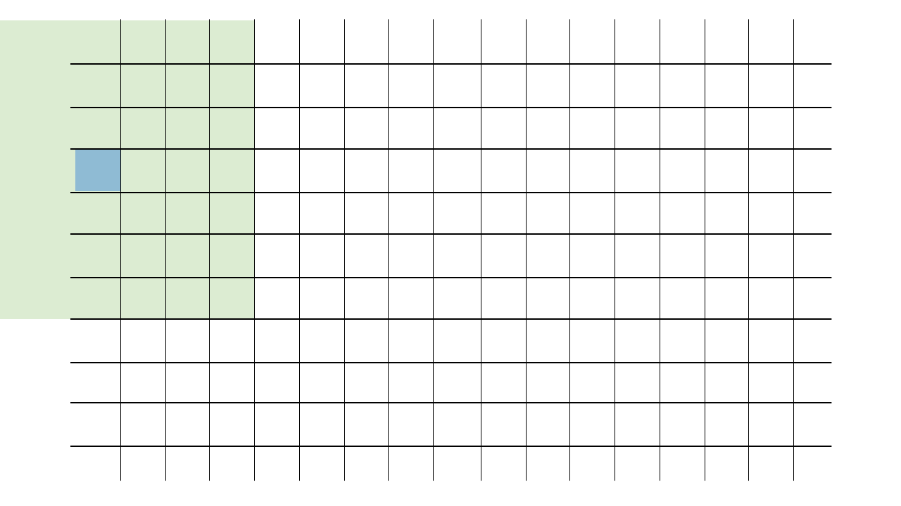
</center>

A good way to approach this would be to use `radius` to slice out a square around the
pixel in question. For example, `Image.slice image ~x_start:0 ~x_end:10 ~y_start:0
~y_end:10` would slice out a 10-by-10 square from the upper left corner of the image.
To get the average of the pixels of an image you can use `Image.mean_pixel`.

Make sure to put all of your results in a new image, instead of overwriting your original
as you go; otherwise, your blurred pixels will cascade on top of each other. Be careful
near the borders of the image. Keep in mind that some approaches to this problem will
result in much slower performance.

When you have implemented a correct solution, running

```sh
dune exec bin/image_exercise.exe -- blur -filename images/beach_portrait.ppm -radius 3
```

should produce a file called `beach_portrait_blur.ppm` that is the same image as
`reference-beach_portrait_blur.png`.

<center>
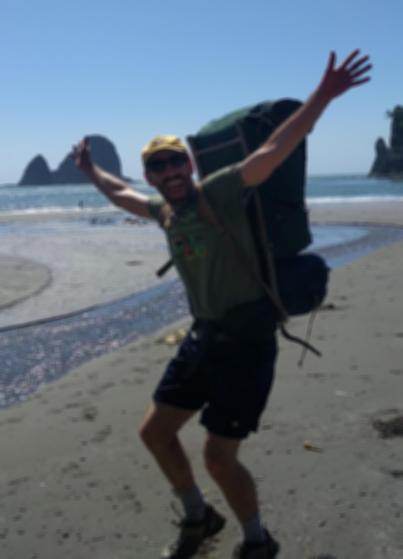
</center>

### Write an expect test
Write an expect test that uses the provided reference image (`images/reference-beach_portrait_blur.png`)
to verify that your solution is correct.

## 4 Dither
In the file called `dither.ml`, implement the `transform` function. Dithering is a
technique used to print a gray picture in a legacy medium (such as a newspaper) where no
shades of gray are available. Instead, you need to use individual pixels of black and
white to simulate shades of gray. A standard approach to dithering is the *Floyd–Steinberg
algorithm*, which works as follows:

1. Loop over all pixels as always, from top to bottom and, within each row, from left to
   right.
2. For each pixel: if its value is larger than half the maximum pixel value, then set it to the maximum value (pure
   white). Otherwise, set it to the minimum value (i.e, all 0s, pure black). Since this is a grayscale image, the red,
   green, and blue channels will all be equal. Record the *error*, which represents how
   much blackness we have added to this pixel, by taking the old value of this pixel minus
   the new one. Note that the error can be positive or negative, depending on whether you
   adjusted the color *blackwards* or *whitewards*.
3. Distribute this pixel's error to adjacent pixels as follows:
    - Add 7/16 of the error to the pixel immediately to the right.
    - Add 3/16 of the error to the pixel immediately diagonally to the bottom left.
    - Add 5/16 of the error to the pixel immediately below.
    - Add 1/16 of the error to the pixel immediately diagonally to the bottom right.

This is an algorithm where a pure functional approach may not work as well. `Image.set`
will likely be useful in distributing the error.

Be careful near the edges of the image! If some *error* should be distributed to a pixel
that doesn't exist (e.g., it's off the edge of the image), you should just ignore that
part of the error.

Some tips:

1. Dithering should only be done on grayscale images&mdash;actually you can dither color
   images, too, but it's a bit more complicated&mdash;so use `Grayscale.transform` to convert an image to
   gray as the first step.
1. In order for dithering to work, you must make your changes to the same image that you
   are looping over. Dithering by reading one image and making your changes on a copy will
   not work correctly, because the *error* never gets a chance to accumulate.

<center>
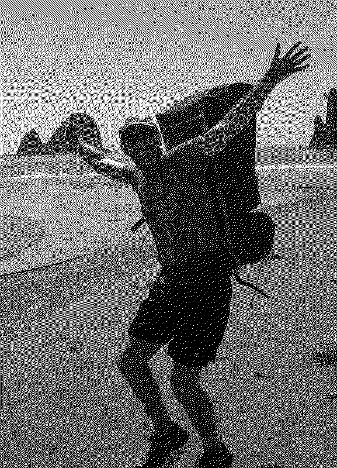
</center>

### Write an expect test
Write an expect test that uses the provided reference image (`images/reference-beach_portrait_dither.png`)
to verify that your solution is correct.

## Extensions

You can do these in any order you like.

### Improved Blue Screening
If you look closely at `oz_bluescreen_vfx.ppm` you will notice a number of small errors
(sometimes called *artifacts*). These include bits of blue mixed in with the meadow
grasses, a blue outline around the balloon basket, and bits of James Franco replaced with
tree pixels. For this challenge, improve the formula used for determining "blue" pixels
such that these errors are avoided. Try and produce an image at least as good as
`reference-oz_bluescreen_vfx_improved.png`.

<center>
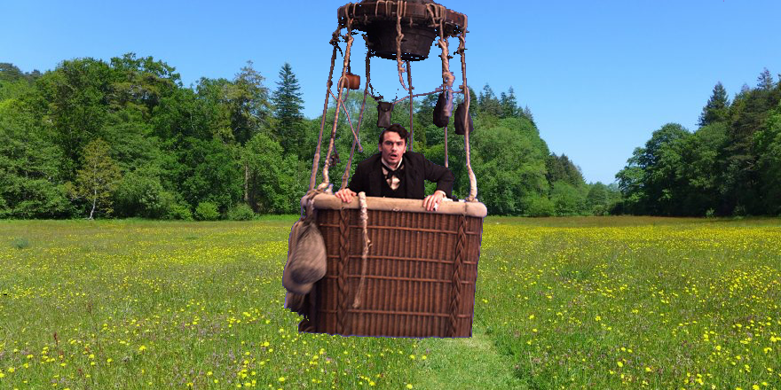
</center>

### Solarize
In film photography, there is an effect called *solarization* where extreme overexposure
of the film results in *tone reversal* (i.e., light colors becoming dark and vice versa).
This often happens when taking a picture of the sun, where the sun will appear as a black
dot.

<center>

</center>

This idea can also apply to digital images, where it's known as *pseudo-solarization*.
This works as follows: given some threshold value, if a color (red, green, or blue) is above the threshold,
invert that color.

An example output image with a threshold of 40% of the maximum pixel value:

<center>
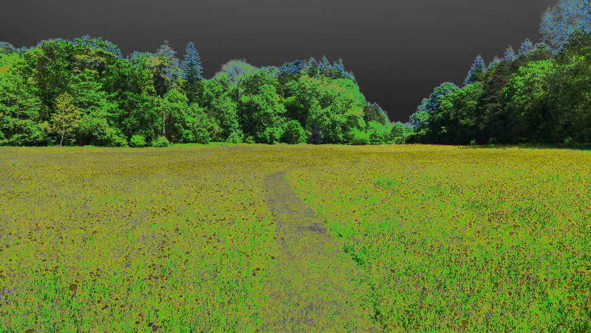
</center>

### Color Dithering

Extend your dithering function to work for color images. It will need to take the desired

number of colors per channel ($n$) as an argument. For example, if $n = 2$, then pixels in
the dithered image will have one of two possible values for red (0 or `max_val`), and
similarly for green and blue (for a total of eight possible colors).

To transform a color in the original image to the corresponding dithered color, you'll
need to round the original color to the closest color in the restricted dithered palette.
Be sure to apply error separately for each color channel.

An example output image with $n = 2$:

<center>
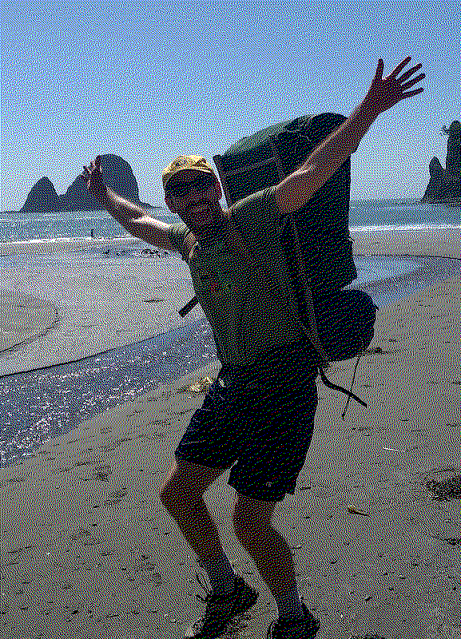
</center>

### Edge Detection

The Sobel edge detection algorithm highlights the edges of objects in an image. It works
by detecting areas with a high variation in pixel values (gradients).

#### Algorithm
The algorithm consists of three steps:

1. Calculate horizontal ($G_x$) and vertical ($G_y$) gradient values for each pixel in the
   image.
2. Calculate the final gradient magnitude for each pixel using the calculated $G_x$ and
   $G_y$ values.
3. Set each pixel to black or white based on whether the magnitude exceeds a user-provided
   threshold

To compute $G_x$ and $G_y$ values, use the following Sobel operator kernels:

$$
G_x =
\begin{bmatrix}
-1 & 0 & 1 \\
-2 & 0 & 2 \\
-1 & 0 & 1
\end{bmatrix}
$$

$$
G_y =
\begin{bmatrix}
-1 & -2 & -1 \\
 0 &  0 &  0 \\
 1 &  2 &  1
\end{bmatrix}
$$

To apply a Sobel operator kernel to a pixel, you must perform a convolution operation. A
convolution is the sum of the element-wise multiplication of the kernel with the
surrounding pixel values. Then, the final gradient magnitude $G$ can be calculated as
follows:

$$G = \sqrt{G_x^2 + G_y^2}$$

If the input image is in color, you should first convert it to grayscale, as the algorithm
works on grayscale images. You might also exploring blurring the input image to reduce the
noise in the detected edges.

Make sure to handle border cases, where the Sobel operator kernel may not fit. One
solution is to ignore the borders or use edge padding (e.g., mirroring the pixels adjacent
to the border).

#### Expected Output

An example output image with a threshold of 40% of the maximum pixel value and a radius-2
blur applied to the input image:

<center>
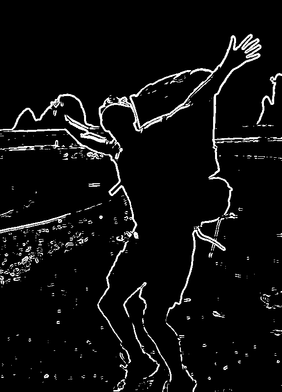
</center>

### Mosaic

In this exercise, you will implement an image mosaic operation that selects a random
region in the input image and replaces it with the most similar region in the image. The
user provides the width and height of the regions to move and the number of moves to
perform.

#### Algorithm

1. Load the input image using `Image.load_ppm`.
2. Repeat the number of `moves` specified by the user:
    1. Select a random region in the image with the user-specified `width` and `height`.
       Let's call it `region1`.
    2. Divide the image into a grid of `width`-by-`height` regions. Let's call this set of
       sub-images `targets`.
    2. Search `targets` for the region (let's call it `region2`) that is the most similar
       to `region1`. Use the mean-squared error (MSE) metric for image similarity.
    3. Swap the pixels of `region1` with the pixels of `region2`.
3. Save the modified image using `Image.save_ppm`.

#### Mean-Squared Error (MSE) Metric

The mean-squared error (MSE) between two equally sized image regions $A$ (width $w$,
height $h$) and $B$ is defined as:

$$
MSE(A, B) = \frac{1}{w \times h} \sum_{x=1}^w \sum_{y=1}^h (A_{xy} - B_{xy})^2
$$

where $A_{xy}$ and $B_{xy}$ are the pixel values at position $(x,y)$ in regions $A$ and
$B$, respectively. The smaller the MSE value, the more similar the image regions are.

#### Expected Output

An example output image created by 10,000 moves of 10 pixel-by-10 pixel regions:

<center>
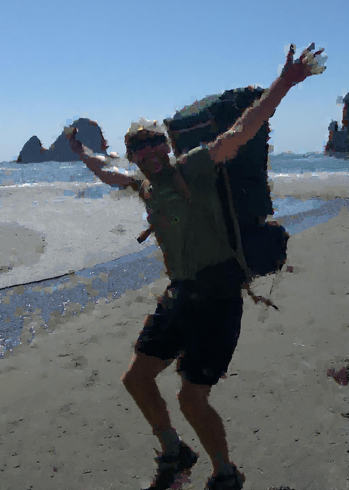
</center>
